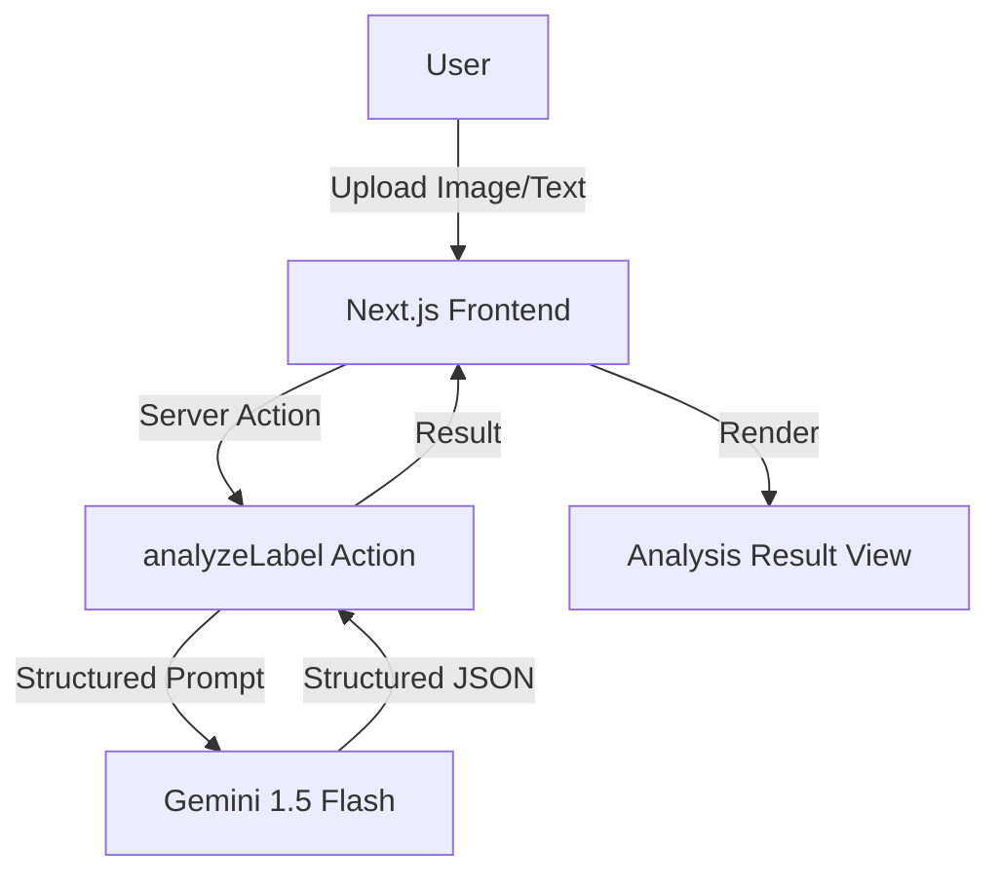

# CleanLabel.ai 🔍

[](https://nextjs.org/)
[](https://js.langchain.com/)
[](https://ai.google.dev/)
[](https://tailwindcss.com/)
[](https://opensource.org/licenses/MIT)

**Instant Food Transparency Powered by Gemini AI.** CleanLabel.ai helps you decode complex nutrition labels, identify hidden additives, and find cleaner alternatives in seconds.

---

## ✨ Features

- **📸 Vision-Based Analysis:** Upload a photo of any nutrition label for instant OCR and ingredient extraction.
- **🧪 Chemical Deep-Dive:** Automatically research obscure E-numbers, synthetic dyes, and controversial additives.
- **📊 Clean Score (0-100):** Get an algorithmic purity rating where 100 is perfectly natural.
- **🌱 Natural Swaps:** AI-curated recommendations for 100% natural, chemical-free alternatives.
- **⌨️ Text Input Support:** No photo? Paste an ingredient list to get the same deep analysis.

---

## 🛠️ Tech Stack

- **Framework:** [Next.js 15](https://nextjs.org/) (App Router, Server Actions)
- **AI Core:** [LangChain.js](https://js.langchain.com/) + [Google Gemini 1.5 Flash](https://ai.google.dev/)
- **State Management:** [Zustand](https://github.com/pmndrs/zustand) (UI) & [TanStack Query](https://tanstack.com/query) (Server State)
- **Styling:** [Tailwind CSS v4](https://tailwindcss.com/) + [shadcn/ui](https://ui.shadcn.com/)
- **Type Safety:** Strict TypeScript implementation

---

## 🚀 Getting Started

### Prerequisites

- [Node.js](https://nodejs.org/) (v18+)
- [pnpm](https://pnpm.io/)
- [Google AI Studio API Key](https://aistudio.google.com/)

### Installation

1. **Clone the repository:**
   ```bash
   git clone https://github.com/your-username/cleanlabel.ai.git
   cd cleanlabel.ai
   ```

2. **Install dependencies:**
   ```bash
   pnpm install
   ```

3. **Set up environment variables:**
   Create a `.env.local` file in the root directory:
   ```env
   GOOGLE_GENERATIVE_AI_API_KEY=your_api_key_here
   ```

4. **Run the development server:**
   ```bash
   pnpm dev
   ```

Open [http://localhost:3000](http://localhost:3000) to start scanning labels.

---

## 🗺️ Architecture



---

## 📈 SEO Keywords

`Clean Label AI`, `Food Ingredient Analyzer`, `Nutrition Label Scanner`, `Gemini AI Health`, `Detect Food Additives`, `Natural Food Finder`, `Nutrition OCR`, `LangChain Vision Example`, `Next.js 15 AI App`

---

## 📄 License

Distributed under the MIT License. See `LICENSE` for more information.
